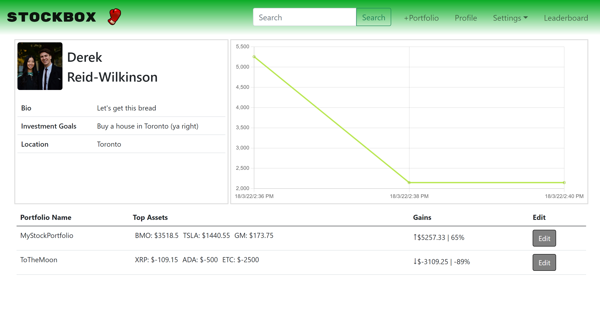

# StockBox
---
## Intro

**StockBox**  Face off against your friends to see who can build the best investment portfolio!
 

    

## Technologies Used
This project uses HTML, CSS, JavaScript, Jquery, Bootstrap, Node.JS, and Express. 

## Getting Started
To check out the app, [click here!](https://stockbox1.herokuapp.com/).

## Next Steps
- Add posts so users can post their actions to a main feed
- Add friends, so people can get updates on what their friends are up to
- Add privacy settings, so people can hide certain actions or portfolios from others